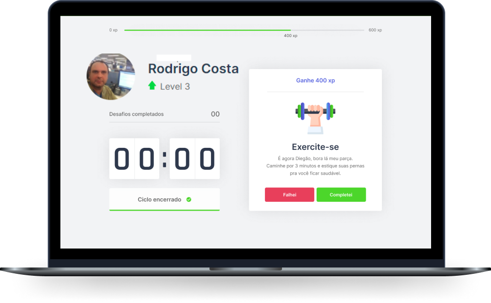

<h1 align="center">
  
</h1>

  <a href="#-tecnologias">Tecnologias</a>&nbsp;&nbsp;&nbsp;|&nbsp;&nbsp;&nbsp;
  <a href="#-preparando-o-ambiente">Preparando o Ambiente</a>&nbsp;&nbsp;&nbsp;|&nbsp;&nbsp;&nbsp;
  <a href="#-codando-react">Codando React</a>&nbsp;&nbsp;&nbsp;|&nbsp;&nbsp;&nbsp;
  <a href="#-codando-nextJs">Codando NextJs</a>&nbsp;&nbsp;&nbsp;|&nbsp;&nbsp;&nbsp;

 

  

## 🚀 Tecnologias

- [React](https://reactjs.org)    
- [Next.js](https://nextjs.org/)    
- [TypeScript](https://www.typescriptlang.org/)    

## 💻 Preparando o Ambiente

Sem mais delongas, vamos ao conteúdo principal desse guia: configuração do seu ambiente para o NLW. 
Teremos três etapas principais na seção <a href="README/README-NEW-INSTALL.md">Instalação</a> ou <a href="README/README-UPD-INSTALL.md">Atualização</a> dos Packages.

- [Chocolatey](https://chocolatey.org/)    
- [Node](https://nodejs.org/en/)    
- [NPM](https://www.npmjs.com/)    
- [Yarn](https://yarnpkg.com/)    
- [VSCode](https://code.visualstudio.com/)    

## 💻 Codando React

- Verificar versões dos pacotes:

  -  TERMINAL=> choco -v
  -  TERMINAL=> node -v
  -  TERMINAL=> npm -v
  -  TERMINAL=> yarn -v

- Criando um projeto React:
   
  - TERMINAL (Com NPM) => npm i create-react-app -g
  - TERMINAL (Com NPM) => npx create-react-app move.it --template=typescript
  - TERMINAL (Com Yarn) => yarn create react-app moveit --template=typescript 

- Rodando a aplicação React:

  - TERMINAL (Com NPM) => npm start
  - TERMINAL (Com Yarn) => yarn start

- Configurando Fontes externas:

  - Fonts utilizadas: Inter (400, 500 e 600) e Rajdhani (600). Acessar page abaixo e buscar pelas fonts x tamanho:
  - [Google Fonts](https://fonts.google.com/)    

  - Após localizadas e adicionadas copiar o Link e add no projeto (Index.html / tag head)

## 💻 Codando NextJs

  - NextJs é um nivel intermediario da aplicação React (front-end) com o back-end.
  - Quando trabalhamos com React usamos o conceito de pagina SPA.
  - Quando trabalhamos com React usamos o conceito de pagina SPA, SSR (Server-side Rendering) e SSG.

- Criando um projeto NextJs:

  - TERMINAL (Com NPM) => npm i create-next-app -g
  - TERMINAL (Com NPM) => npx create-next-app move.it-next
  - TERMINAL (Com NPM) => npm add typescript @types/react @types/react-dom @types/node -D

- Rodando a aplicação NextJs:

  - TERMINAL (Com NPM) => npm run dev

  

